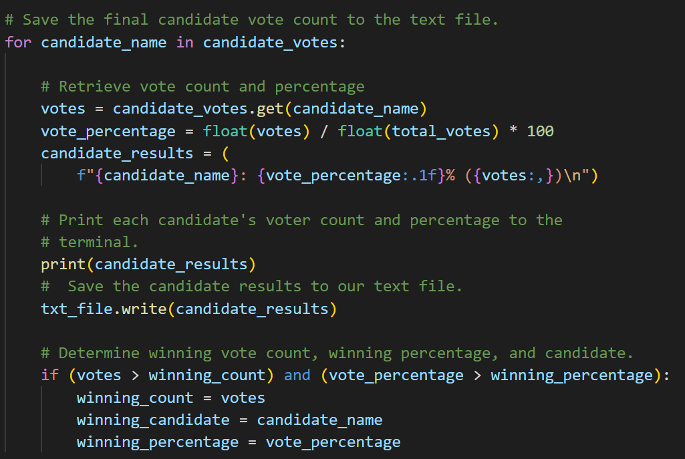
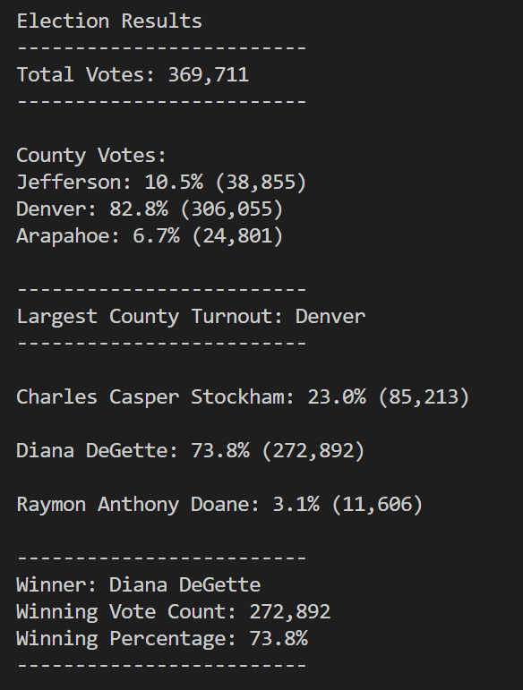

# Election_Analysis

## Project Overview
A Colorado Board of Elections employee has given me the followng tasks to complete the election audit of a recent local congressional election.

1. Calculate the total number of votes cast.
2. Calculate the total number of voters for each county.
3. Calculate the percentages of votes from each county  out of the total vote count
4. Determind the county with the highest turnout.
5. Get a complete list of candidates who received votes.
6. Calculate the total number of votes each candidate received.
7. Calculate the percentage of votes each candidate won.
8. Determine the winner of the election based on popular vote.

## Resources
- Data source: election_results.csv
- Software: Python 3.7.6, Visual Studio Code 1.74.1

## Results
#### **The analysis of the election show that:**

-There were 369,711 votes cast in the election.
- The Counties represented were:
  - Jefferson
  - Denver
  - Arapahoe

- The County results were:
  - Jefferson County received 10.5% of the vote and 38,855 votes.
  - Denver County received 82.8% of the vote and 306,055 votes.
  - Arapahoe County received 6.7% of the vote and 24,801 votes.
- The County with the largest turnout was:
  - Denver County, which received 82.8% of the vote and 306,055 votes.
- The candidates were:
  - Charles Casper Stockham
  - Diana DeGette
  - Raymon Anthony Doane
- The candidate results were:
  - Charles Casper Stockham received 23.0% of the vote and 85,213 votes.
  - Diana DeGette received 73.8% of the vote and 272,892 votes.
  - Raymon Anthony Doane received 3.1% of the vote and 11,606 votes.
- The winner of the election was:
  - Diana DeGette, who received 73.8% of the vote and 272,892 votes.

## Summary

I have developed a tool for the Election Commission that processes and analyzes election results data efficiently and accurately. The program reads in a CSV file and organizes the information into two categories: candidate and county. It tracks the overall total number of votes and the total number of votes received by each candidate and county, calculates the percentage of votes they received and determines the winning candidate and the county with the highest voter turnout based on the vote count and percentage. It also generates a summary report in a text file, including the total vote count, individual votes and percentages by county, the county with the largest voter turnout, votes and percentage by candidate and the winner of the election based on the popular vote. This program can be adapted for any election with similar data CSV format, can also be modified to calculate other statistics such the lowest number of votes for a candidate or the lowest voter turnout for a county or city. This would take slight modifications in the code such as changing a greater than symbol to less than or changing the name of the “county” variable to “city”.
